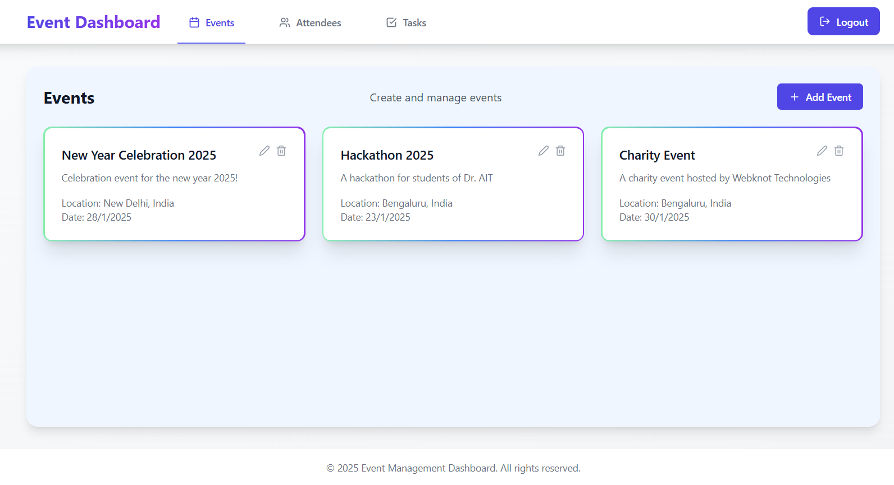

# Event Management App

The application is deployed at [Deployment Link](https://your-deployment-link.com).

This is an Event Management Application that allows users to create, manage, and participate in events. The application provides a user-friendly interface to handle all event-related activities.

## Features

- Manage events (CRUD operations)
- Manage attendees and assign them tasks
- Track tasks related to events with progress visualization

## Screenshots

### Login/SignUp Page


### Event Management Page
Users can create, edit, delete events with fields such as name, description, location and date. <br /><br />


### Attendee Management Page
Users can create, edit, delete attendees with fields such as name, phone number and email. <br /><br />


### Task Tracker Page
Users can create, edit, delete, check/uncheck and assign tasks to attendees of specific events with ease. <br /><br />


## How to Run This Project

### Prerequisites

- Node.js
- npm (Node Package Manager)
- Firebase

### Setup

1. Clone the repository:
    ```bash
    git clone https://github.com/yourusername/event-management-app.git

    cd event-management-app
    ```

2. Install dependencies:
    ```bash
    npm install
    ```

3. Set up Firebase:
    - Create a Firebase project in the [Firebase Console](https://console.firebase.google.com/).
    - Add a web app to your Firebase project.
    - Add necessary collections and fields to your project.
    - Copy the Firebase configuration and update the `.env` file with your Firebase credentials.

4. Start the application:
    ```bash
    npm run dev
    ```

5. Open your browser and navigate to `http://localhost:5173`.